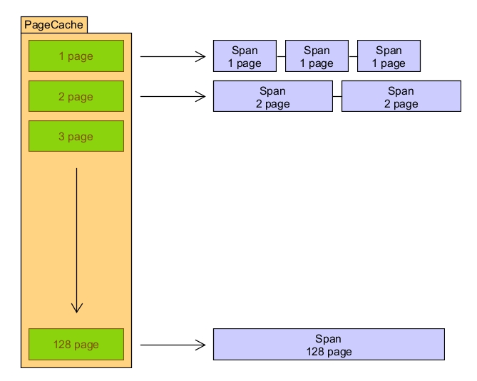
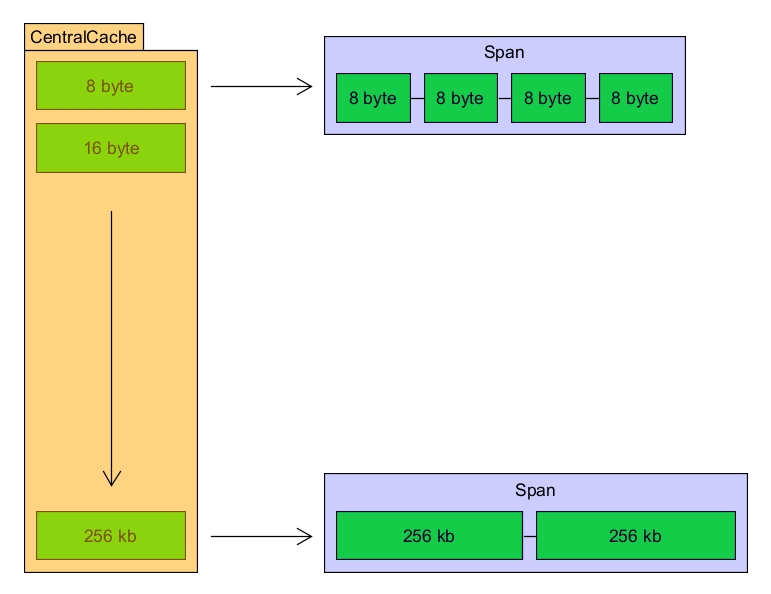
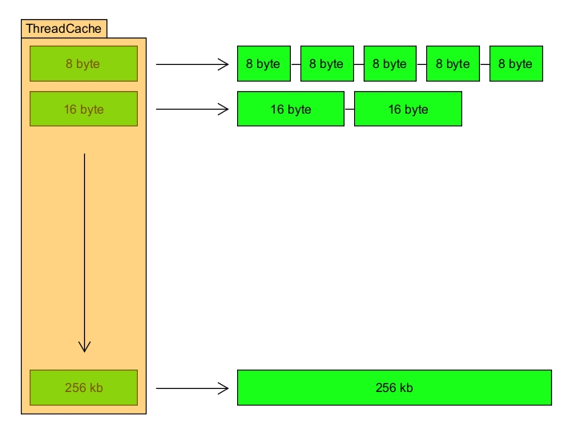

# WW-Memory-Pool

该项目是`WW`系列中，作为学习用途的内存池库

## 特点

+ 采用`tcmalloc`的三层缓存架构，提高内存的分配效率

+ C++11风格，代码易读性强

## 结构

采用三层缓存的结构，其中

+ 页缓存`PageCahce`: 管理整片页段的缓存，负责从系统中获取整页内存，将其切片成小块页段提供给中心缓存

+ 中心缓存`CentralCache`: 管理批量的小块内存，负责从页缓存中获取小块内存，并批量提供给线程缓存

+ 线程缓存`ThreadCache`: 管理少量的小块内存，负责从中心缓存中获取小块内存，并提供给应用程序使用

### 页缓存`PageCahce`

页缓存以页为单位管理内存，在中心缓存申请内存时，页缓存挑选合适的页段，然后将其切片成小块页段提供给中心缓存



### 中心缓存`CentralCache`

中心缓存从页缓存中获取合适大小的页段，然后根据需要的内存块大小，切割为一定数量的内存块，挂载到一个内存块链表上，供线程缓存使用



### 线程缓存`ThreadCache`

线程缓存从中心缓存中批量获取内存块，供应用程序申请使用



## 使用

### 直接使用

直接操作线程缓存实例，示例见[threadcache_test.cpp](test/src/threadcache_test.cpp)

```cpp
#include <ThreadCache.h>

int main()
{
    // 获取线程缓存实例
    WW::ThreadCache & thread_cache = WW::ThreadCache::getThreadCache();
    // 申请8字节内存
    void * ptr = thread_cache.allocate(8);
    // 使用内存
    int * p = new(ptr) int(42);
    // 归还内存
    thread_cache.deallocate(ptr, 8);

    return 0;
}
```

### 封装使用

将内存池封装为分配器等，示例见[memory_test.cpp](test/src/memory_test.cpp)

```cpp
pointer allocate(size_type n, const void * hint = nullptr)
{
    (void)hint;
    if (n > max_size())
        throw std::bad_array_new_length();

    if (n == 0)
        return nullptr;

    return static_cast<pointer>(thread_cache.allocate(n * sizeof(T)));
}

void deallocate(pointer ptr, size_type n)
{
    if (ptr == nullptr)
        return;
    
    thread_cache.deallocate(ptr, n * sizeof(T));
}
```
